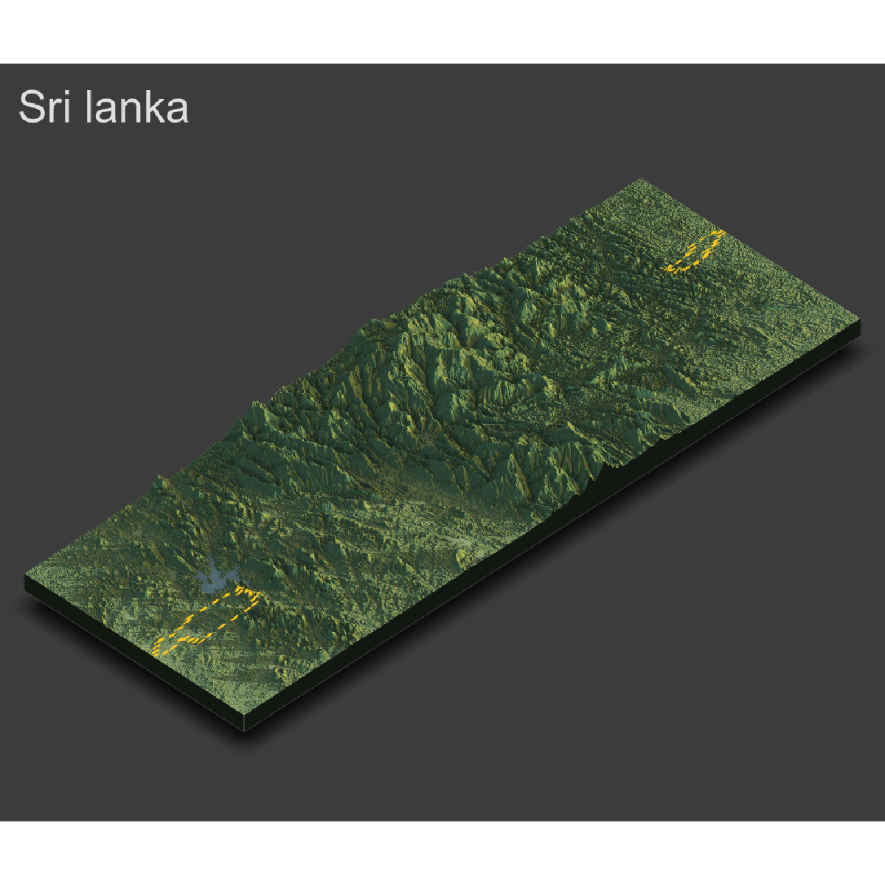

# Sri Lanka 

This is my final prject on Sri Lanka

## Administrative subdivisions of Sri Lanka 

Sri Lanka, officially the Democratic Socialist Republic of Sri Lanka, is an island country in South Asia, located in the Indian Ocean to the southwest of the Bay of Bengal and to the southeast of the Arabian Sea. This country is made up of 9 different provinces which are then subdivided into 25 different districts. 

The main problem I encounterd during this project was not the coding, but getting Rstudio to work comfortably on my laptop and not causing it to take days to finish running a simple 5 lines of code. 

## Population of Sri Lanka 

The population in Sri Lanka is spread very evenly amongst most of the districts. The two highest districts in this country are Gampaha and Colombo which are right next to eachother and each have 11% of the population residing in each of the districts. These two districts are the most populated because they are on the coast of the island where most of their imports and exports are for the country so major cities are planted inside these districts where all the business happens. 

The problem I encountered during this part is that at first the raster files I used for a different country were way to big. so my computer was taking as long as a day to run the code. After switching to a smaller country like Sri Lanka I was able to finish this part in no time. 

## Bar Graph of the Population Distribution

The bar shows how evenly spread most of the poputlation is for most of the districts. Not one general district appears to be over populated, it all appears to be nice and spread so people inthis country are living on top of eachother. 

## Population Estimation of Dompe 

## Density Estimation of Dompe 

## Health Care Sites in SRI Lanka 

In Dompe there approximately 6 different health care sites. Most of them are clinics but there are some hospitals as well. I believe they have more clinics because they are easier for citizens to be able to get check ins and simple appointments for simple illnesses and not serious cases. 

## Topography of Sri Lanka 

By looking at the topography of. Sri lanka there is a mountain system that is in the middle of it. Due to this mountain system there are currently no roadways that connect the upper and lower parts of this country. Due to this, people 
must fly or go around the mountains to be able to travel between these two sides of the country. 
